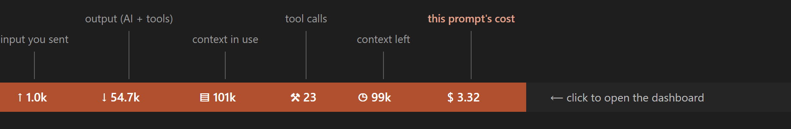
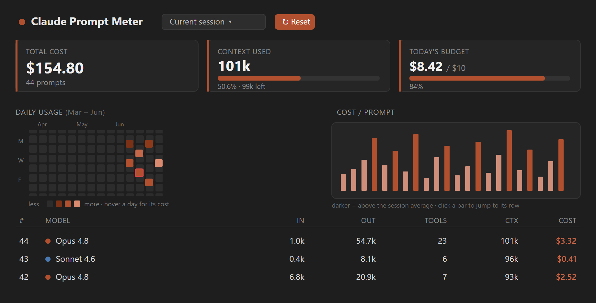

<div align="center">


# 💳 Claude Prompt Meter

### เห็นชัดๆ ว่า **แต่ละ prompt ของ Claude Code จ่ายเท่าไหร่** — ตรงบน status bar

[English](README.md) · **ไทย**

แสดง token + ค่าใช้จ่ายรายprompt, แดชบอร์ดพร้อม heatmap การใช้จ่ายย้อนหลัง 1 ปี,
คิดราคาอัตโนมัติตามโมเดล, ตั้งงบรายวัน, และ UI สองภาษา **ไทย / อังกฤษ**
ทั้งหมดอ่านจาก log ในเครื่องของ Claude Code เอง — **ไม่ใช้ API key, ไม่ต่อเน็ต, ไม่มี telemetry**

[](https://marketplace.visualstudio.com/items?itemName=ryukenshin546-a11y.claude-prompt-meter)
[](https://marketplace.visualstudio.com/items?itemName=ryukenshin546-a11y.claude-prompt-meter)
[](https://marketplace.visualstudio.com/items?itemName=ryukenshin546-a11y.claude-prompt-meter&ssr=false#review-details)
[](https://open-vsx.org/extension/ryukenshin546-a11y/claude-prompt-meter)
[](LICENSE)
[](#-ความต้องการและแพลตฟอร์ม)
[](#-ความเป็นส่วนตัว)
[](#-การใช้งาน)

<br/>



<sub>status bar อัปเดตสดขณะ Claude Code ทำงาน คลิกเพื่อเปิดแดชบอร์ด</sub>

</div>

---

## 📑 สารบัญ

- [นี่คืออะไร](#-นี่คืออะไร)
- [ฟีเจอร์](#-ฟีเจอร์)
- [การติดตั้ง](#-การติดตั้ง)
- [การใช้งาน](#-การใช้งาน)
- [ทำงานยังไง](#-ทำงานยังไง)
- [ราคาและโมเดล](#-ราคาและโมเดล)
- [การตั้งค่า](#-การตั้งค่า)
- [การรีเซ็ตทำงานยังไง](#-การรีเซ็ตทำงานยังไง)
- [ความเป็นส่วนตัว](#-ความเป็นส่วนตัว)
- [ความต้องการและแพลตฟอร์ม](#-ความต้องการและแพลตฟอร์ม)
- [คำถามที่พบบ่อย](#-คำถามที่พบบ่อย)
- [สัญญาอนุญาต](#-สัญญาอนุญาต)

---

## 👋 นี่คืออะไร

[Claude Code](https://claude.com/claude-code) เขียน log ละเอียดของทุก session ลงในเครื่องคุณ
(หนึ่งไฟล์ `*.jsonl` ต่อหนึ่ง session) log พวกนั้นมีจำนวน token ที่ Anthropic คิดเงินจริงอยู่ —
input, output, และ cache read/write — ของทุกๆ รอบการคุย

**Claude Prompt Meter อ่าน log พวกนั้นแล้วแปลงเป็นตัวเลขที่ใช้งานได้จริง:** แต่ละ prompt
จ่ายเท่าไหร่, วันนี้ใช้ไปแล้วเท่าไหร่, prompt ไหนแพง, และแนวโน้มการใช้จ่ายตลอดทั้งปี
มันไม่เคยคุยกับ API เลย — แค่อ่านไฟล์ที่ Claude Code เขียนไว้อยู่แล้ว

> ℹ️ โปรเจกต์ชุมชน ไม่เป็นทางการ **ไม่มีส่วนเกี่ยวข้องกับ Anthropic** มันแค่ *อ่าน*
> log ในเครื่องของ Claude Code เท่านั้น ไม่แก้ไข และไม่ส่งอะไรออกไปไหนทั้งสิ้น

---

## ✨ ฟีเจอร์

| | |
|---|---|
| 💳 **ค่าใช้จ่ายรายprompt** | token input / output / cache **และ** ค่าเงิน USD ของทุก prompt สดบน status bar |
| 🏷️ **คิดราคาตามโมเดลอัตโนมัติ** | ตรวจว่าแต่ละ prompt ใช้โมเดลไหน (Opus 4.8, Sonnet 4.6, Haiku 4.5, Fable 5, …) แล้วคิดเรตให้ถูก — แม้สลับโมเดลกลาง session |
| 📊 **แดชบอร์ด session** | เปิดในตัว editor **หรือ** docked ที่ sidebar (Activity Bar) มียอดรวม, ตารางรายprompt, และ badge โมเดล |
| 🗓️ **heatmap ค่าใช้จ่าย 1 ปี** | ปฏิทินแบบ GitHub แสดงการใช้จ่ายรายวันรวมทุก session เอาเมาส์ชี้วันไหนเห็นค่าใช้จ่ายเป๊ะ วันที่เกินงบมีกรอบแดง |
| 📈 **sparkline ค่าใช้จ่าย** | แท่งต่อหนึ่ง prompt — prompt ที่แพง (เกินค่าเฉลี่ย) จะเข้มกว่า **คลิกแท่งเพื่อกระโดดไปแถวนั้น** |
| 🎯 **งบรายวัน** | ตั้งงบ USD ต่อวันแล้วดู % ที่ใช้ไป **คลิกการ์ดงบ** เพื่อแก้ — ไม่ต้องเข้า Settings |
| 🔁 **รีเซ็ตรายsession** | เริ่มนับใหม่เฉพาะ session ที่ดูอยู่ โดยไม่กระทบ session อื่นเลย |
| 🌐 **สองภาษา** | สลับไทย / อังกฤษ ได้ทันที |

---

## 🖼️ แดชบอร์ด

<div align="center">

</div>

การ์ดสรุป, **heatmap** การใช้จ่ายย้อนหลัง 1 ปี, **sparkline** ค่าใช้จ่ายรายprompt (คลิกแท่ง
เพื่อกระโดดไปแถวนั้น), และ **ตารางรายprompt** พร้อม badge โมเดลแยกสี — ทั้งหมดมาจาก log
ในเครื่องคุณ เปิดในตัว editor หรือ dock ที่ sidebar ก็ได้

---

## 📦 การติดตั้ง

### จาก Marketplace

1. เปิด **Extensions** (`Ctrl/Cmd + Shift + X`)
2. ค้นหา **“Claude Prompt Meter”**
3. กด **Install**

### จากไฟล์ `.vsix`

```bash
code --install-extension claude-prompt-meter-*.vsix
```

จากนั้น **reload หน้าต่าง** (`Ctrl/Cmd + Shift + P` → **Developer: Reload Window**) แล้วเปิด
โฟลเดอร์ที่คุณใช้กับ Claude Code มิเตอร์จะโผล่บน status bar เอง

---

## 🚀 การใช้งาน

เปิด **Command Palette** (`Ctrl/Cmd + Shift + P`) แล้วพิมพ์ *Claude Prompt Meter*:

| คำสั่ง | ทำอะไร |
|---|---|
| **Open Dashboard** | เปิดแดชบอร์ดเต็มในตัว editor (หรือคลิกมิเตอร์บน status bar / ไอคอนเกจที่ Activity Bar) |
| **Set Daily Budget** | ใส่จำนวนเงิน USD (เว้นว่างเพื่อลบ) คลิกการ์ดงบก็ได้ |
| **Reset Counter** | เริ่มนับ session นี้ตั้งแต่ตอนนี้ (ดู [การรีเซ็ตทำงานยังไง](#-การรีเซ็ตทำงานยังไง)) |
| **Toggle Language (Thai / English)** | สลับภาษา UI ทันที |
| **Refresh** | อ่าน log ใหม่ (แทบไม่ต้องใช้ — มันอัปเดตเอง) |

ทุกอย่างอัปเดตสด (ภายใน ~1.5 วิ) ขณะที่ Claude Code เขียนลง log

---

## 🧠 ทำงานยังไง

```text
~/.claude/projects/<workspace-ของคุณ>/<session-id>.jsonl
        │
        ├─ อ่าน token usage + โมเดล จากแต่ละ "usage" block
        ├─ จับรอบการคุยกลับไปรวมที่ prompt ต้นทางที่สั่ง
        ├─ คิดราคา token แต่ละชนิดตามโมเดลที่สร้างมัน
        └─ render status bar, แดชบอร์ด, heatmap & sparkline
```

โฟลเดอร์ log ของ workspace ถูกหาให้อัตโนมัติจากโฟลเดอร์ที่คุณเปิดอยู่ ดังนั้น build
เดียวกันใช้ได้ทุกเครื่อง ทุกผู้ใช้ — ไม่ต้องตั้งค่า path อะไรเลย

---

## 💰 ราคาและโมเดล

ราคาถูก **ตรวจรายprompt** จากโมเดลที่บันทึกไว้ใน log ดังนั้น session ที่สลับจาก Sonnet
ไป Opus จะคิดราคาถูกต้องตลอด เรต (USD ต่อ 1M token):

| โมเดล | Input | Output |
|---|---:|---:|
| Opus 4.8 / 4.7 / 4.6 | $5 | $25 |
| Sonnet 4.6 / 4.5 | $3 | $15 |
| Haiku 4.5 | $1 | $5 |
| Fable 5 / Mythos 5 | $10 | $50 |
| รุ่นเก่า 3.x (Opus / Sonnet / Haiku) | — | — |

token แบบ cache-read และ cache-creation คิดตามเรต cache มาตรฐานของแต่ละโมเดล สำหรับ
โมเดลที่ไม่รู้จักหรือกำหนดเอง จะใช้เรต fallback ใน **Settings**

---

## ⚙️ การตั้งค่า

**Settings → Extensions → Claude Prompt Meter**

| การตั้งค่า | ค่าเริ่มต้น | คำอธิบาย |
|---|---|---|
| `claudePromptMeter.budget.dailyUsd` | `null` | งบรายวันเป็น USD แสดงเป็น % ใน tooltip และแดชบอร์ด |
| `claudePromptMeter.pricing.inputPerMillion` | `3` | เรต input fallback สำหรับโมเดล **ที่ไม่รู้จัก** |
| `claudePromptMeter.pricing.outputPerMillion` | `15` | เรต output fallback |
| `claudePromptMeter.pricing.cacheReadPerMillion` | `0.3` | เรต cache-read fallback |
| `claudePromptMeter.pricing.cacheCreatePerMillion` | `3.75` | เรต cache-write fallback |

> 💡 ปกติไม่ต้องไปแตะราคา — โมเดลที่รู้จักคิดให้อัตโนมัติอยู่แล้ว fallback ใช้เฉพาะกับ
> โมเดลที่ extension ไม่รู้จักเท่านั้น

---

## 🔁 การรีเซ็ตทำงานยังไง

รีเซ็ต **ไม่ทำลายข้อมูล และเป็นรายsession** มันบันทึก timestamp ของ session ที่คุณดูอยู่
แล้วแค่ *ซ่อน* prompt ก่อนหน้านั้น เพื่อให้ตัวนับค่าใช้จ่าย/งบเริ่มใหม่จากจุดนั้น

- ✅ กระทบเฉพาะ session ที่คุณกำลังดู — session อื่นยอดเต็มเหมือนเดิม
- ✅ ไม่ลบหรือแก้ไฟล์ log ใดๆ
- ✅ อยู่รอดข้าม reload และ restart

> ℹ️ extension สร้าง session ใหม่ของ Claude ไม่ได้ (มีแต่ Claude Code ที่ทำตอน `/clear`)
> ดังนั้นรีเซ็ตคือ *การนับใหม่ภายใน session เดิม* ไม่ใช่รายการใหม่ใน dropdown ของ session

---

## 🔒 ความเป็นส่วนตัว

- **ไม่มีการต่อเน็ต** extension ไม่เคยติดต่อ Anthropic API หรือเซิร์ฟเวอร์ใดๆ
- **ไม่มี telemetry** ไม่เก็บและไม่ส่งอะไรทั้งสิ้น
- **อ่านอย่างเดียว** อ่านแค่ log `*.jsonl` ในเครื่องของ Claude Code ไม่เคยเขียนทับ
- การตั้งค่าทั้งหมด (ภาษา, งบ, รีเซ็ต) อยู่ใน VS Code profile ของคุณเอง

---

## 🖥️ ความต้องการและแพลตฟอร์ม

- **VS Code 1.95** ขึ้นไป
- **Claude Code** — ข้อมูลมาจาก log session ใต้ `~/.claude/projects`

> ⚠️ **เรื่องแพลตฟอร์ม — อ่านก่อน** การพัฒนาและทดสอบทำบน **Windows** เป็นหลัก
> macOS และ Linux รองรับเต็มในโค้ด (หาโฟลเดอร์ log ด้วยการ match working directory
> ที่บันทึกไว้ ซึ่งจัดการ filesystem ที่ case-sensitive ได้) แต่ **ยังไม่ได้ทดสอบบนเครื่องจริง**
> บน macOS/Linux ถ้ามิเตอร์ขึ้น *“waiting…”* ให้เช็กว่าโฟลเดอร์ที่เปิดเป็นโฟลเดอร์เดียวกับ
> ที่ใช้กับ Claude Code ยินดีรับ report มากๆ

---

## ❓ คำถามที่พบบ่อย

**status bar ขึ้น “waiting…” ทำไม?**
โฟลเดอร์ที่เปิดยังไม่มี session ของ Claude Code หรือไม่ใช่โฟลเดอร์ที่คุณรัน Claude Code
เปิดโฟลเดอร์โปรเจกต์ที่ใช้จริงกับ Claude Code มิเตอร์จะโผล่เมื่อมี log session

**ตัวเลขตรงกับบิล Anthropic จริงไหม?**
คำนวณจากจำนวน token เดียวกับที่ Anthropic บันทึกใน log คิดตามเรตต่อโมเดลที่ประกาศไว้ —
เป็นค่าประมาณการที่แม่นยำตามการใช้งาน แต่ไม่รวมเครดิตแพ็กเกจ ส่วนลด หรือภาษี

**ใช้ได้โดยไม่ต้องมี API key ไหม?**
ได้ มันอ่านแค่ไฟล์ในเครื่อง ไม่มีอะไรต้อง authenticate

**ทำไม extension ไม่แสดงไอคอนใน sidebar โดยปริยาย?**
มันแสดงนะ — ไอคอนเกจเล็กๆ ใน **Activity Bar** เปิดแดชบอร์ด ส่วนตัวมิเตอร์เองอยู่บน
**status bar** (มุมขวาล่าง)

**ใช้กับหลายโปรเจกต์ / หลายผู้ใช้ได้ไหม?**
ได้ มันตามดู workspace ที่คุณเปิดอยู่ และ state ทั้งหมดเป็นราย VS Code profile ดังนั้น
ผู้ใช้ต่างคนบนเครื่องเดียวกันจะแยกกัน

---

## 📄 สัญญาอนุญาต

[MIT](LICENSE) © ryukenshin546-a11y

<div align="center"><sub>สร้างมาเพื่อทุกคนที่เคยสงสัยว่า “prompt เมื่อกี้จ่ายไปเท่าไหร่นะ?”</sub></div>
